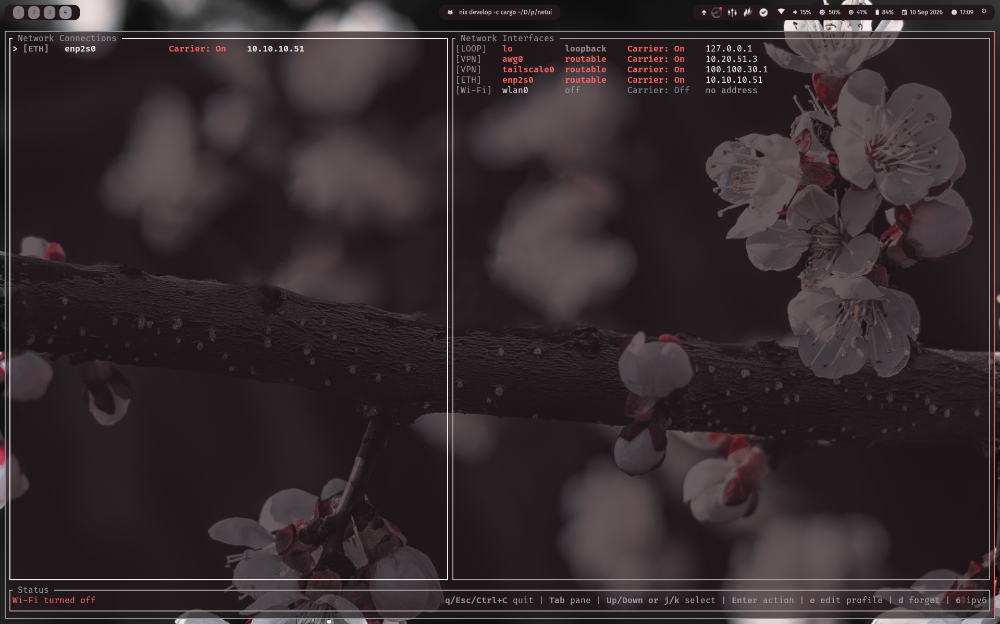

# netui


A lightweight, keyboard-driven Terminal User Interface (TUI) network manager built with Rust and Ratatui, engineered strictly for pure **IWD + systemd-networkd + systemd-resolved** stacks with zero NetworkManager dependency.



## Core Architecture

`netui` keeps each responsibility small and explicit:

- **Wi-Fi association and scanning:** direct IWD D-Bus integration through `net.connman.iwd`.
- **Interface and link tracking:** systemd-networkd D-Bus data, supplemented by sysfs where appropriate.
- **DNS and DNS-over-TLS:** systemd-resolved through `org.freedesktop.resolve1`.
- **Profile management:** an in-memory session store designed for declarative, NixOS-friendly systems.

The application does not require or invoke NetworkManager.

## Features

- Dual-pane view of active network connections and system interfaces.
- Keyboard-first navigation, connection actions, and session-profile editing.
- Direct IWD scanning and association with non-fatal handling for disabled Wi-Fi adapters.
- Privacy-first address formatting: link-local IPv6 (`fe80::/10`) addresses are always hidden to avoid EUI-64 MAC-address leakage.
- Live IPv6 display toggle with only non-link-local IPv6 addresses shown when enabled.
- DNS-over-TLS policy control through systemd-resolved.
- Non-wrapping, responsive status footer with styled, width-aware keybind hints.
- Backend errors are contained in the TUI state rather than leaking D-Bus failures into the terminal.

## Keybindings

| Key | Action |
| --- | --- |
| `q` / `Esc` / `Ctrl+C` | Quit |
| `Tab` | Switch pane |
| `↑` / `↓` or `j` / `k` | Navigate items |
| `Enter` | Activate / connect selected item |
| `e` | Edit session profile |
| `d` | Forget selected Wi-Fi network |
| `6` | Toggle IPv6 display |

## Building And Installation

### Nix flakes

Run the application directly from the repository:

```sh
nix run
```

Enter the development shell and run from Cargo:

```sh
nix develop -c cargo run
```

### Cargo

Install the Rust toolchain and D-Bus development headers, then build an optimized binary:

```sh
cargo build --release
```

The binary is written to `target/release/netui`.

### Runtime prerequisites

`netui` is intended for systems running:

- `iwd`
- `systemd-networkd`
- `systemd-resolved`

The application uses the system D-Bus. Wi-Fi association requires an active IWD service; DNS-over-TLS controls require an active systemd-resolved service.

## License

`netui` is distributed under the [MIT License](LICENSE).
